<h2>12" Powerbook Disassembly and Repair</h2>

  
How to replace your cracked screen in a 12&quot; Powerbook

  
This is a disassembly of my 12&quot; Powerbook in order to replace my cracked LCD.

 *Note: After doing all this, I found it is possible to replace the screen without total disassembly if you can reach the Torx 6 screws in the screen. (You might have to bend a hex wrench to get it so small).

  
The following is a recount of my repair on my laptop. Please be careful if you want to do this yourself as there is a chance that you will break your laptop. I am not responsible if you screw up your laptop. Please email me to tell me about your experience doing this.

  
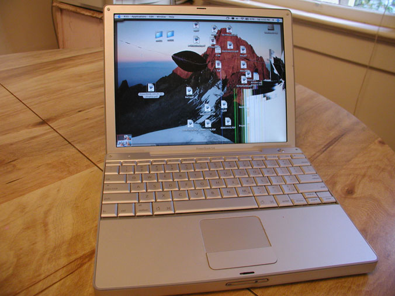

  
So my laptop screen got busted at the airport and I was pretty bummed out. After thinking about what I could do, I decided to replace the LCD  myself. I found out the 12&quot; iBook has the same screen as the Powerbook, and I was able to get a hold of a broken iBook with a working screen.

  
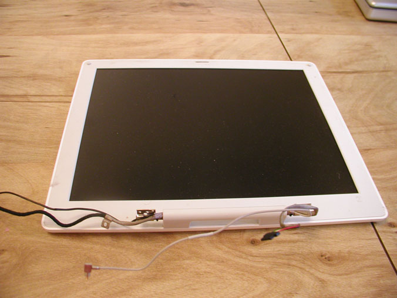 

          
This is the 12&quot; screen from the iBook G4 (1.2Ghz) which I disassembled 
            without paying much attention because the iBook was broken. I just 
            removed every screw I saw.

  
&nbsp;

  
<strong>Tools I used</strong>

  <ul>
    <li>mini Philips screw driver</li>
    <li>mini Flathead screw driver </li>
    <li>Torx 6 screw driver</li>
    <li>Coin (quarter works best) </li>
    <li>plastic knife</li>
    <li>pliers or hex nut driver</li>
  </ul>
  
&nbsp;

  
First I removed the LCD panel

  <table width="200" border="0">
    <tr>
      <td><a href="P1010004.JPG">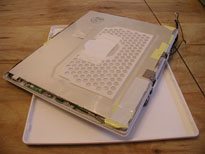</a></td>
      <td><a href="P1010005.JPG">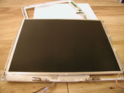</a></td>
      <td><a href="P1010006.JPG">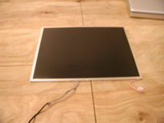</a></td>
    </tr>
  </table>
  
Now I was ready to carefully take apart my Powerbook

  
<a href="P1010007.JPG">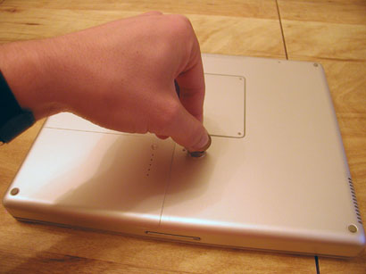</a> 

  
First I removed the battery by using a coin. 

  
<a href="P1010008.JPG">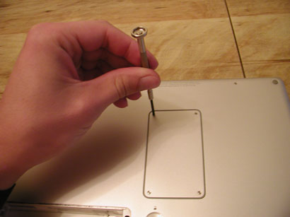</a>

  
Then I removed the memory cover on the back 

  
<a href="P1010009.JPG">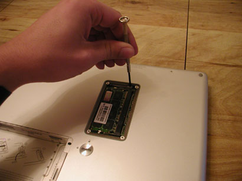</a>

  
I removed the long black screw securing the keyboard. 

  
<a href="P1010010.JPG">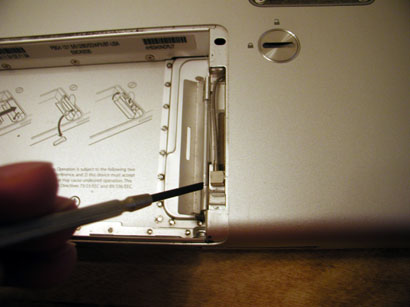</a>

  
I unplugged the airport antennae after opening the latch.

  
<a href="P1010011.JPG">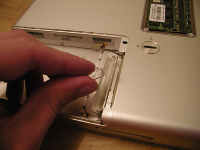</a>

  
I removed a little plastic stopper which was glued on before I could remove the airport card. 

  
<a href="P1010012.JPG">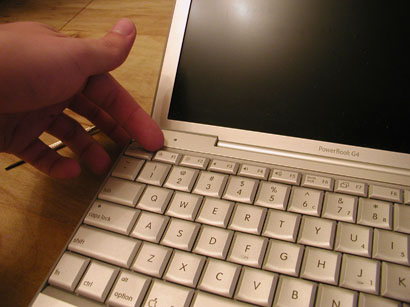</a>

  
To remove the keyboard, I had to pop off the F1,F2,F11,F12 keys. I did this by prying them off with my fingernail from the top left corner.

  
<a href="P1010013.JPG">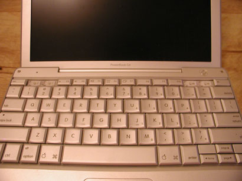</a> 

  
I was careful so they wouldn't break. 

  
<a href="P1010014.JPG">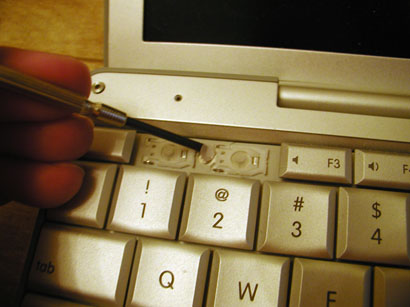</a>

  
I then removed the covering stickers and unsrewed the keyboard. 

  
<a href="P1010015.JPG">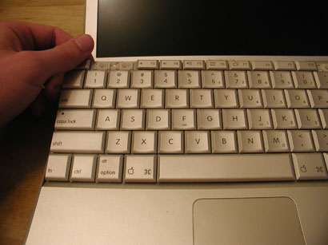</a>

  
Using my two index fingers I lifted the keyboard from the top.

  
<a href="P1010016.JPG">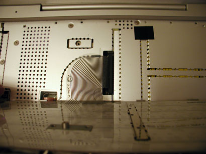</a>

  
I disconnected the keyboard cable from the laptop as I held the keyboard vertical.

  
<a href="P1010017.JPG">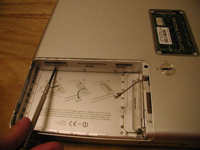</a>

  
Turning the laptop over, I took out some more screws.

  
<a href="P1010018.JPG">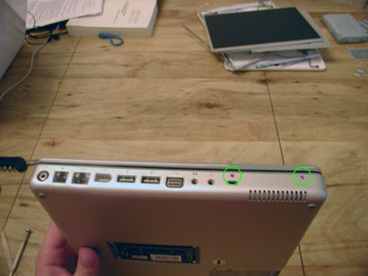</a> 

  
Now I unscrewed the sides.

  
<a href="P1010019.JPG">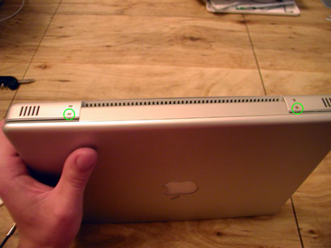</a>

  
And also remove the screws in the back.

  
<a href="P1010020.JPG">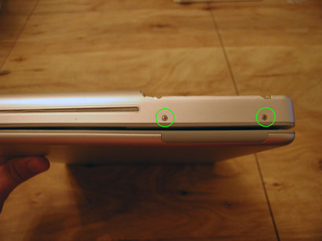</a>

  
And the other side too.

  
<a href="P1010021.JPG">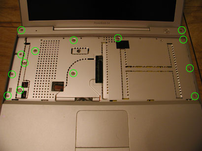</a>

  
I remove all these screws as well.

  
<a href="P1010022.JPG">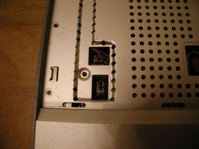</a> 

  
I then unplugged the two plugs on the left. I didn't pull on the cables so that I didn't damage the plug.

  
<a href="P1010023.JPG">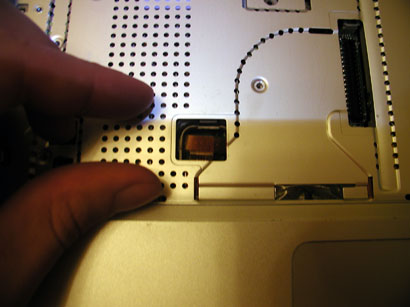</a>

  
I then unplugged the power cable by pulling the yellow loop.

  
<a href="P1010024.JPG">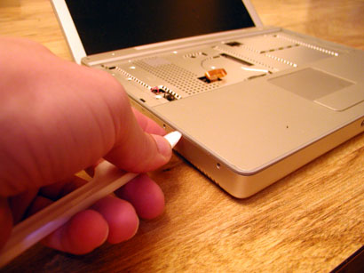</a>

  
Now for the tricky part. I used the knife to slowly loosen the casing all around the sides. Then eventually the top came off. 

  
<a href="P1010025.JPG">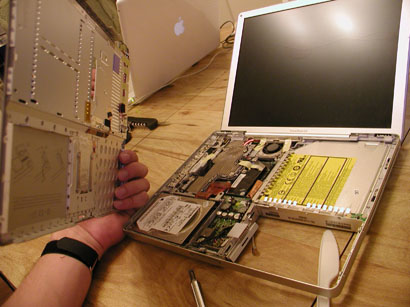</a>

  
Now we get to see the guts!

  
<a href="P1010026.JPG">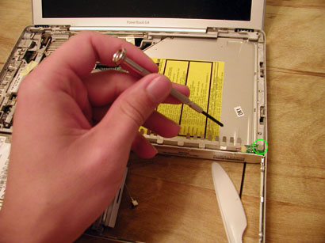</a>

  
Remove the read switch

  
<a href="P1010028.JPG">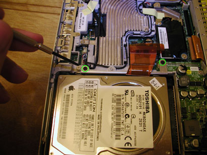</a>

  
I unscrew the hard drive bracket

  
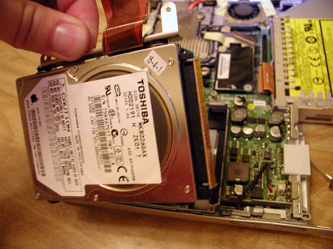

  
Then I disconnect the hard drive cable and remove the hard drive.

  
<a href="P1010030.JPG">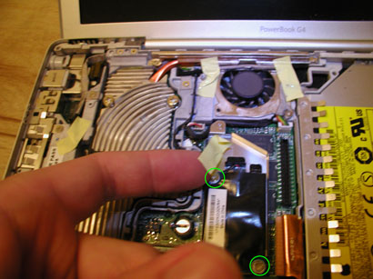</a> 

  
I remove the tape and unscrew the modem.

  
<a href="P1010032.JPG">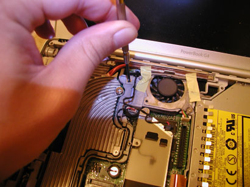</a>

  
I remove the screw that fastens the inverter cable.

  
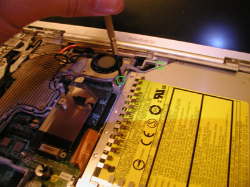

  
I remove two more screws.

  
<a href="P1010034.JPG">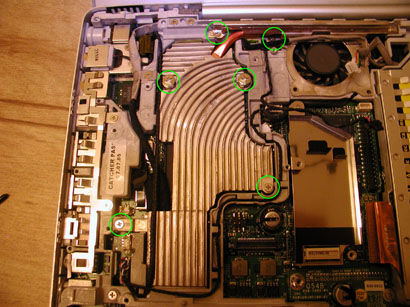</a>

  
I remove the screws holding the heat sink.

  
<a href="P1010036.JPG">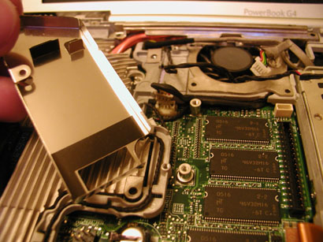</a>

  
I removed the modem casing. 

  
<a href="P1010038.JPG">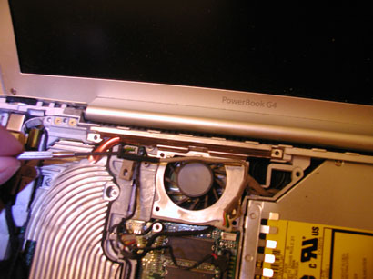</a>

  
I disconnected the fan connector.

  
<a href="P1010039.JPG">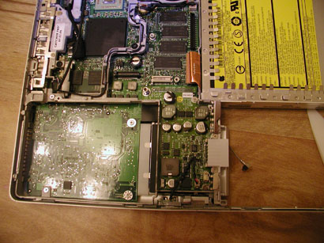</a>

  
I removed the heat sink. 

  
<a href="P1010040.JPG">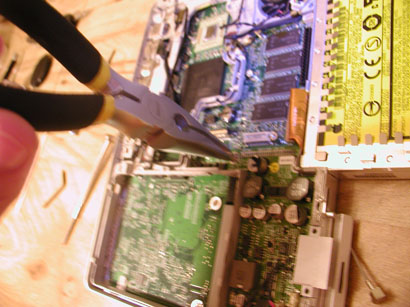</a>

  
I unscrew the hex nut/screw with some pliers.

  
<a href="P1010041.JPG">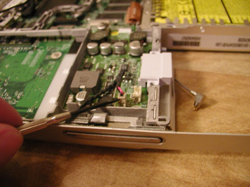</a>

  
I unplug the plug on the DC-to-DC board and unscrew all the screws on the board.

  
<a href="P1010042.JPG">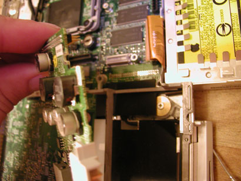</a>

  
Then I remove the DC-to=DC board. 

  
<a href="P1010043.JPG">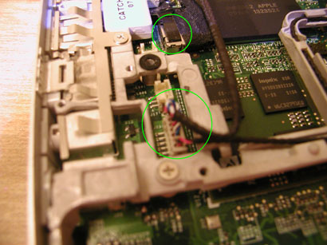</a>

  
I remove the rest of the cables including the display data cable. 

  
<a href="P1010044.JPG">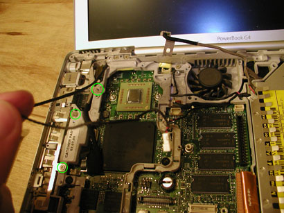</a>

  
I removed the screws holding the EMI fingers and the RJ-11 board.

  
<a href="P1010047.JPG">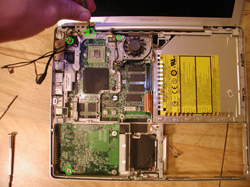</a>

  
I removed the rest of the screws from the framework.

  
<a href="P1010049.JPG">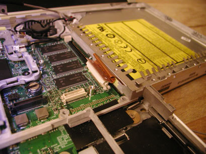</a>

  
I disconnected the DVD-RW drive. 

  
<a href="P1010051.JPG">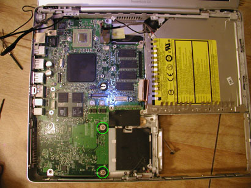</a>

  
Here's the laptop with the framework removed. Now I remove the last screws from the logic board.

  
<a href="P1010053.JPG">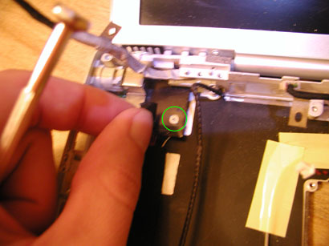</a>

  
Now I remove the DC-in board and slide it out.

  
<a href="P1010054.JPG">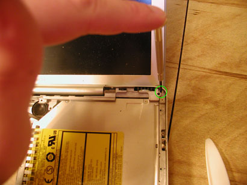</a>

  
I removed both screws from the upper right corner of the laptop.

  
<a href="P1010055.JPG">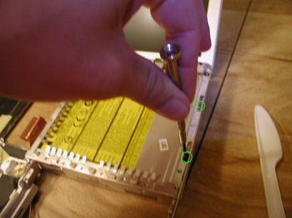</a>

  
Now I remove the two remaining screws from the optical drive. 

  
<a href="P1010056.JPG">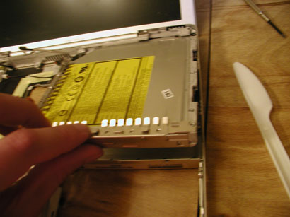</a>

  
I remove the optical drive by lifting it from the botton. 

  
<a href="P1010057.JPG">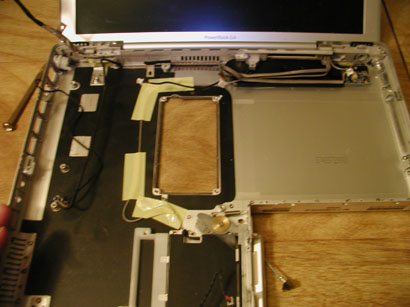</a>

  
Here's the laptop with the optical drive removed. 

  
<a href="P1010058.JPG">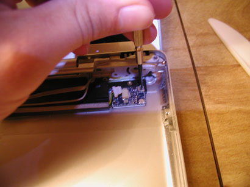</a>

  
I disconnect the bluetooth cable and unscrew the bluetooth board. 

  
<a href="P1010059.JPG">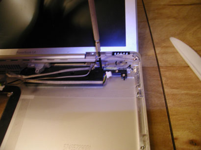</a>

  
I remove the tape, unscrew the subwoofer, and remove it.

  
<a href="P1010060.JPG">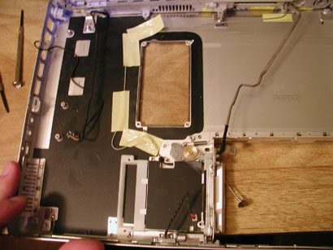</a>

  
Here's what's left of the laptop.

  

  
I remove the tape from the airport extreme antennae. 

  

  
Turning the case over, I remove the last screws.

  

  
And on the top as well. 

  

  
Now the screen has been detached.

  

  
Using the Torx driver I remove both of the bottom screws.

  

  
I loosen the plastic casing using my knife so that I don't damage the laptop.

  

  
I find it easier to use the flathead screwdrivers after a while. 

  

  
Here's what the screen looks like open. 

  

  
I disconnect the video calbe from the LCD. 

  

  
I remove the screws holding the LCD to the screen.

  
&nbsp;

  
That's the disassembly of my 12&quot; Powerbook. Now I take the working screen of the iBook and install it. Then I assemble my Powerbook in reverse order of disassembly. Once I finished putting my Powerbook back together, it works again. Yay!

Some complications others have run into: 
	It was tricky to unplug the backlight plug if removing the back screen cover without disassembling the laptop. 
	On the same note someone found the backlight cable to be too short when replacing the screen with a iBook screen (although it worked for me)
